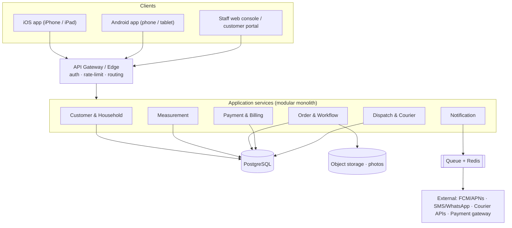
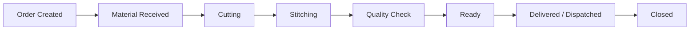
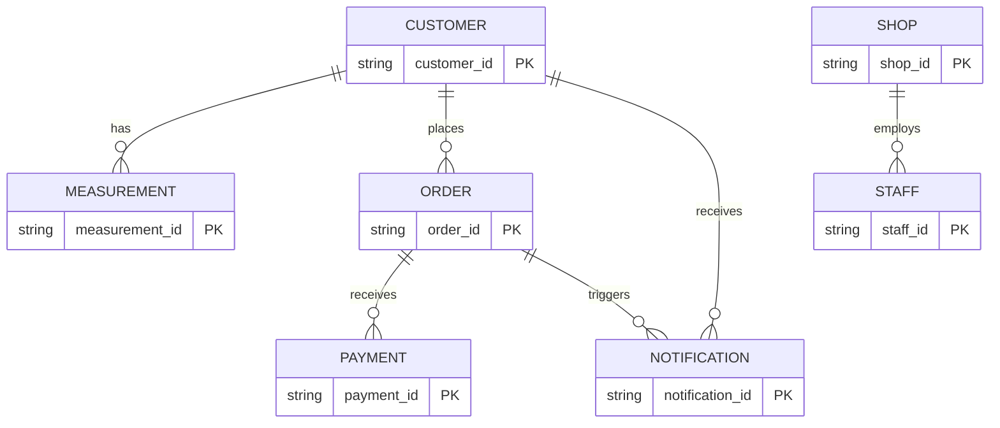

# Threadline — Architecture

> Tailoring Shop Management Application · Requirements → UX → Data → Stack → System Architecture
>
> This document follows the authoritative spec **_Threadline_Requirements_Design_Architecture_ (v1.0)**. This repository is the **Phase‑1 interactive prototype** referenced in that spec — see [§9, "This repository"](#9-this-repository-the-phase-1-prototype) for exactly what it implements today versus the full production target.

Threadline is a **mobile-first** application for a local dress-materials and tailoring shop. Shop staff manage the end-to-end custom-stitching lifecycle; customers track their own orders. It targets native apps on phone and iPad plus a staff web console, backed by a shared cloud service, so the counter and the customer always see consistent, up-to-date information.

---

## 1. Objectives

- Give every customer a **durable unique ID** that survives shared household phone numbers.
- Store **versioned measurement profiles** per customer per garment type, reusable across visits.
- Capture stitching requirements (lining, material source, design notes, reference-photo notes) against every order.
- Track the **full order lifecycle** with automatic customer notifications at key milestones.
- Record advance payments and running balances accurately, with partial payments.
- Support in-person **and courier-based** dispatch and receipt.
- Work equally well on a phone at the counter and an iPad used as a fixed terminal.

## 2. User roles

| Role | Can do | Primary device |
| --- | --- | --- |
| **Staff / Tailor desk** | Register customers, record measurements, create & progress orders, record payments, manage dispatch, send updates | iPad at counter, phone for mobility |
| **Owner / Admin** | Everything staff can, plus reporting, staff accounts, shop config (garment types, pricing) | iPad or phone |
| **Customer** | Look up own profile by phone (select ID if shared), view order status, balance, measurement history, notifications | Phone app / web portal |

---

## 3. System architecture (layers)

A layered client-server architecture: responsive clients talk to a single API gateway, which fronts a set of application services sharing one relational database, with object storage for photos and external integrations for notifications, courier tracking, and payments.

**Layers**

| Layer | Responsibility |
| --- | --- |
| **Client apps** | iOS & Android (phone + tablet) and a lightweight staff web console / customer web portal. Share business logic via a common design system and API client. |
| **API / Edge** | Single API gateway: staff auth (JWT), OTP-based customer lookup, rate limiting, routing. |
| **Application services** | Modular services — Customer & Household, Measurement, Order & Workflow, Payment & Billing, Dispatch & Courier, Notification. Starts as a modular monolith, splittable later. |
| **Data & integrations** | PostgreSQL (system of record), object storage for photos, Redis for cache/session/queue state, a message queue for async notifications. |
| **External** | FCM/APNs push, SMS/WhatsApp Business API, courier partner APIs/webhooks, payment gateway (UPI/card). |

**Key decisions**

- **Modular monolith first** — one deployable backend with clean module boundaries; lower ops overhead for a single shop, with a clear path to split services as volume grows.
- **Redundant measurement snapshots** — each order stores a locked copy of the measurements used, so history stays accurate even after the master profile changes.
- **Household by shared phone** — many `Customer` rows may share one phone number; no separate household entity.
- **Async notifications** — dispatched via a queue so slow SMS/WhatsApp/courier calls never block staff actions.

---

## 4. Order workflow

Eight defined states, with automatic customer notifications at key milestones (especially **Ready** and **Delivered/Dispatched**):

Priority per order: **Normal / Urgent / Express**. Collection modes: **customer pickup**, **shop delivery**, **courier dispatch** (courier company, tracking number, dispatch date) — plus recording items **received** from a customer via courier.

---

## 5. Data schema

Core entities (PK = primary key, FK = foreign key). Measurement history is versioned; order snapshots are immutable.

- **Customer** — `customer_id` (e.g. `CUS-000123`, immutable), name, `phone` (not unique — households share), `alt_phone`, address, `gender_category`, notes, `created_at`.
- **Measurement Profile & Version** — `measurement_id`, `customer_id` (FK), `garment_type`, `version` (increments per customer + garment), `fields` (JSON), notes, `recorded_at`.
- **Order** — `order_id` (e.g. `ORD-2026-000456`), `customer_id` (FK), `garment_type`, `measurement_snapshot` (JSON, locked), `requirements` (JSON: lining, material_source, material_notes, design_details, special_instructions, photo_note), `price`, `advance`, `delivery_date`, `priority`, `status`, `status_history` (JSON array of `{status, timestamp}`), `dispatch` (JSON: mode, courier_company, tracking_number, dispatch_date), `created_at`.
- **Payment** — `payment_id`, `order_id` (FK), `amount`, `mode` (Cash/UPI/Card/Bank), `reference?`, `recorded_at`.
- **Notification** — `notification_id`, `customer_id` (FK), `order_id?` (FK), `event`, `message`, `channel` (Push/SMS/WhatsApp/In-app), `read`, `sent_at`.
- **Staff & Shop config** — `staff_id`, name/phone/role (Owner·Admin / Staff), `shop_id` (FK, multi-branch ready), `garment_templates` (JSON: measurement field templates per garment type).

---

## 6. UX design

- **Navigation:** a Staff / Customer role toggle. Staff = five destinations shown as a **navigation rail** on tablet/iPad and a **bottom tab bar** on phone: **Dashboard · Customers · New Order · Orders · Notifications**. Customer = a single simplified flow (phone lookup → household disambiguation → personal home with ID, orders, balances, measurements, notifications).
- **Key screens:** Dashboard (stat cards + attention list), Customer search & profile (household siblings, versioned measurements, order history), 5-step **New Order wizard**, Order detail (status tracker, requirements, locked snapshot, payment ledger, dispatch fields), Customer self-service home (ID card with scan code, orders, notifications).
- **Visual direction:** deep **indigo** (dye-vat blue) primary, warm **marigold/gold** accent, soft **muslin/parchment** background. Serif headings + grotesque sans body + **monospace for IDs**. Signature **running-stitch dashed rule** as a divider and a **stitched progress tracker** for the workflow. Status colours: queue = indigo, active = gold, Ready = green, overdue = red.

---

## 7. Technology stack (production target)

| Layer | Recommendation |
| --- | --- |
| Mobile client | **Flutter** (one codebase, iOS + Android, phone + iPad) |
| Web console / portal | **React + TypeScript**, responsive |
| Backend API | **Node.js (NestJS)** modular-monolith |
| Database | **PostgreSQL** (relational integrity + JSON columns for flexible fields) |
| Cache / queue | **Redis** + managed queue (SQS / Pub-Sub) |
| Object storage | **S3 / GCS** (reference photos) |
| Push | **FCM** (Android/web) + **APNs** (iOS) |
| SMS / WhatsApp | Regional SMS gateway + **WhatsApp Business API** |
| Auth | **JWT** staff login; **OTP** customer lookup |
| Hosting | Managed cloud (AWS/GCP), containers (ECS / Cloud Run), Kubernetes once multi-branch |
| CI/CD | **GitHub Actions** — build/deploy mobile + backend |
| Observability | Centralized logging + error tracking (Sentry) + uptime monitoring |

---

## 8. Deployment strategy

- **Environments:** Development (seeded sample data — the prototype) → Staging (production-like, UAT with shop staff) → Production (isolated data, backups, monitoring).
- **Release:** backend + web deploy via CI/CD on merge to release, gated by tests; mobile via CI to TestFlight / Play internal, then store review; DB via versioned migrations with rollback; **feature flags** for staged workflow rollout.
- **Backup & recovery:** daily DB backups with 30-day point-in-time recovery; versioned object storage; documented recovery runbook.
- **Security:** TLS everywhere, data encrypted at rest, RBAC (staff scoped to shop, customer scoped to own `customer_id`), full audit log.
- **Monitoring:** uptime + API latency alerting; notification delivery tracking with retry; usage dashboards (orders created, turnaround time, overdue rate).

---

## 9. This repository — the Phase‑1 prototype

The spec's **Phase 1 (Core MVP)** is "the interactive prototype already reviewed" — that is **this codebase**. It implements the Phase‑1 scope as a **single responsive web app** (the fastest path to a reviewable prototype), not yet the full native/production stack in §7.

**What Phase 1 covers here:** customer registration & household handling · measurements · order creation & a status workflow · payments & running balances · an in-app notification/activity feed · plus a customer self-service portal and a customer service-request inbox.

**Prototype stack (what's actually running):**

| Area | Prototype | → Production target (§7) |
| --- | --- | --- |
| Client | React 18 + TypeScript + Vite (single responsive web app; macOS-desktop shell) | Flutter mobile + React web console |
| Backend | Vercel serverless functions (`/api`) | NestJS modular monolith |
| Database | PostgreSQL via Prisma | PostgreSQL (same) |
| Offline | `localStorage` cache, offline-first, mirrors to the API when a DB is set | Staff-app offline sync queue (Phase 3) |
| Notifications | In-app activity feed | + Push / SMS / WhatsApp (Phase 2) |
| Auth | Phone (demo OTP) | JWT staff + OTP customer |
| Deploy | GitHub → Vercel | GitHub Actions → managed cloud |

**Implemented to the spec** (Phase‑1):

- The full **8-stage order workflow** (Order Created → Material Received → Cutting → Stitching → Quality Check → Ready → Delivered/Dispatched → Closed).
- **Versioned measurements** (per customer + garment, history never overwritten) and an **immutable measurement snapshot locked to each order**.
- Order **priority** (Normal / Urgent / Express).
- The spec's **indigo (dye-vat) + marigold + muslin** visual direction, in light and dark.

**Still simplified** (deferred to later phases):

- Dispatch is a local/courier flag rather than the full courier-company / tracking-number fields; notifications are an in-app feed (no push / SMS / WhatsApp yet); IDs use the shorter `CUS-0001` / `S-42` forms; the UI is a desktop-window metaphor rather than the rail-and-tab responsive layout.

The prototype's own build, data model, and endpoints are documented in **[`README.md`](./README.md)** (setup) and **[`BACKEND.md`](./BACKEND.md)** (schema, API, deploy).

---

## 10. Delivery roadmap

| Phase | Scope |
| --- | --- |
| **Phase 1 — Core MVP** | Registration & household, versioned measurements, order creation & workflow, payments/balances, in-app notifications. *(This prototype.)* |
| **Phase 2 — Native & channels** | Flutter iOS/Android, push + SMS/WhatsApp, customer self-service portal, courier dispatch/receipt tracking. |
| **Phase 3 — Scale & insights** | Multi-branch, staff roles/permissions, reporting dashboards, online payment, offline-first sync for the staff app. |
