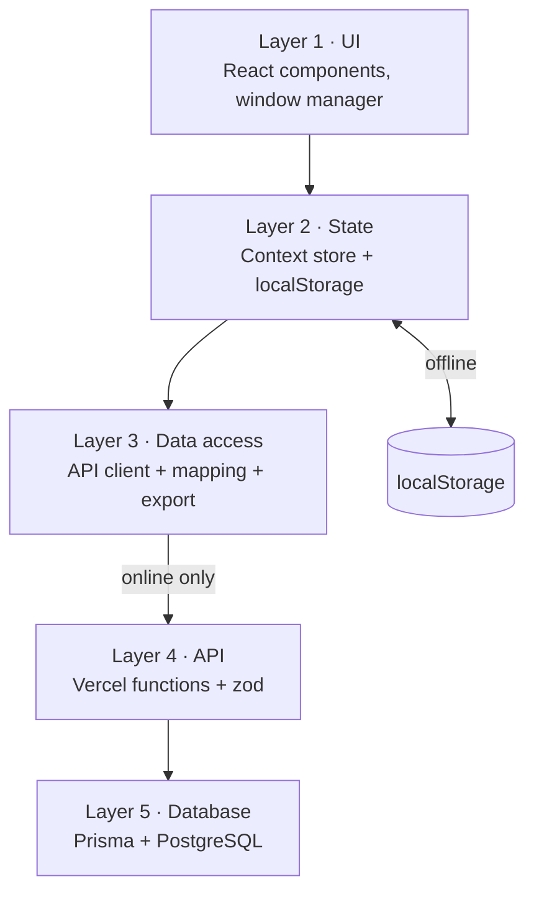
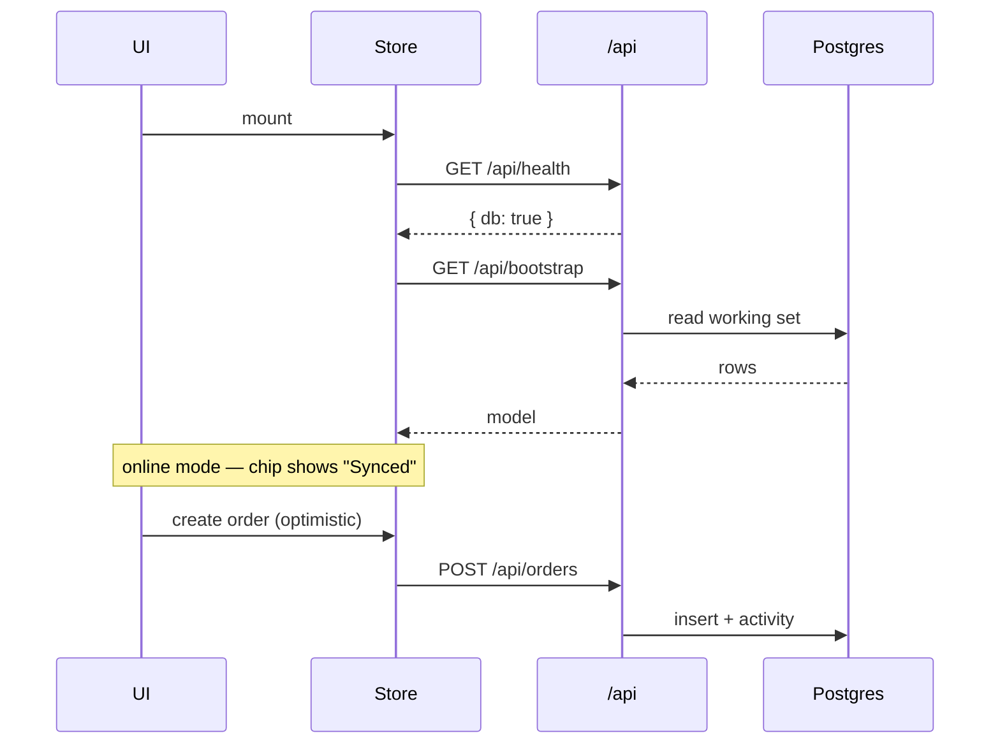
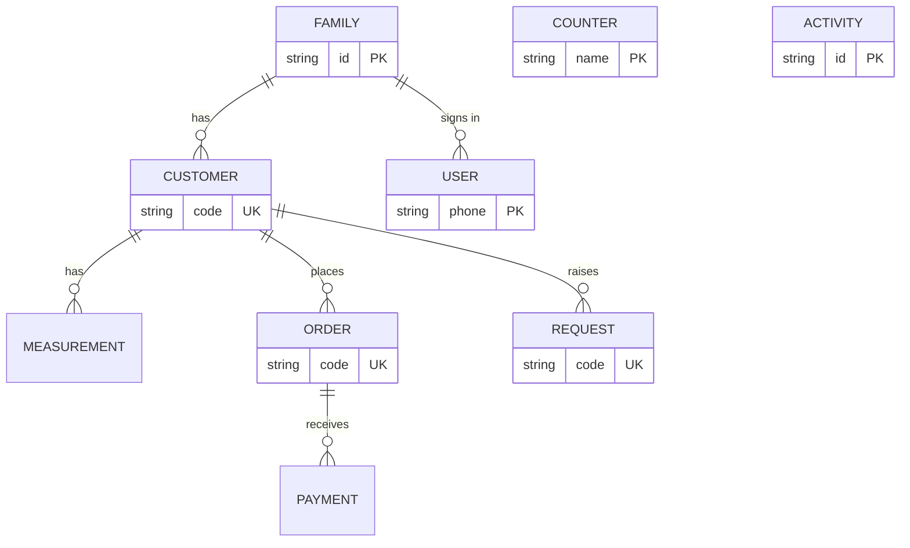

# Architecture — Silai

Silai is a **local-first** React app with an **offline-capable core** that upgrades to a **serverless Postgres** backend when a database is connected. The same UI runs in both modes; the store decides which at startup and degrades gracefully.

- **Frontend:** React 18 + TypeScript, Vite 5, CSS-variable design tokens (no UI framework)
- **Backend:** Vercel Serverless Functions (Node) + Prisma ORM + zod validation
- **Database:** PostgreSQL (Neon / Vercel Postgres)
- **Deploy:** GitHub → Vercel (static build + `/api` functions)

Scale of the prototype: **43 source files · ~3,500 LOC · 11 serverless functions · 9 DB models.**

---

## The five layers

Each layer talks only to the one below it.

| # | Layer | Responsibility | Key files |
| --- | --- | --- | --- |
| 1 | **UI** | React components: macOS desktop shell (menubar, draggable window, dock, bubbles), floating-window manager, feature modules, primitives, bespoke SVG icons, CSS-drawn garment art, virtualized list | `components/Shell.tsx`, `components/windows/*`, `components/Icon.tsx`, `components/GarmentArt.tsx`, `components/VirtualList.tsx`, `modules/*` |
| 2 | **State** | One Context `Store` holds the in-memory model, persists to `localStorage`, runs the hybrid online/offline mode, owns phone auth + theme. Reads are synchronous so the UI never changes between modes | `data/store.tsx`, `data/types.ts`, `data/seed.ts` |
| 3 | **Data access** | Typed API client, a mapping layer (app model ↔ API: lowercase enums / human ids ↔ UPPERCASE enums / `cuid`s via code→id ref maps), and CSV/JSON export helpers | `data/api.ts`, `data/remote.ts`, `lib/exportData.ts` |
| 4 | **API** | Vercel serverless functions in `/api`. Shared `/lib`: method router with CORS + error handling, Prisma singleton (warm reuse), atomic human-code counters, zod schemas | `api/*.ts`, `lib/http.ts`, `lib/prisma.ts`, `lib/validation.ts`, `lib/codes.ts` |
| 5 | **Database** | PostgreSQL via Prisma — 9 models, indexed on real access paths, cascade deletes, enums, a `Counter` for unique codes. Pooled connection for functions, direct for migrations | `prisma/schema.prisma`, `prisma/seed.ts` |



---

## How data flows

### Offline — the default

No database required; runs anywhere, instantly.

1. The store boots from `localStorage` (or seeds fresh sample data).
2. Components read the in-memory model synchronously via `useStore()`.
3. Every mutation updates state and writes back to `localStorage`.

### Online — when a database is configured

1. On mount, the store pings `GET /api/health`.
2. If the DB is reachable, `GET /api/bootstrap` hydrates the whole working set in **one call** and the store switches to online mode.
3. Mutations apply locally for an instant UI, then **mirror** to the API in the background.
4. The API validates (zod), writes via Prisma, and logs an `Activity` row.



A menubar chip shows the live mode — **Synced** or **Offline**. Human ids (`CUS-0001`, `S-42`, `REQ-0001`) stay stable in the UI while a **code → cuid** ref map lets the store address server rows.

---

## Domain model

The shop's paper workflow, as a relational schema.



- A **Family** has many **Customers** and **Users** (phone auth; `owner` or `member`).
- A **Customer** has many **Measurements**, **Orders** and **Requests**.
- An **Order** has many **Payments**; stage flows New → Cutting → Stitching → Ready → Delivered.
- A **Request** carries a type, a status, and a JSON `history` timeline.
- **Activity** is a flat, indexed audit trail. **Counter** issues human codes atomically (inside a transaction) so ids stay unique under concurrency.
- Deleting a customer cascades to their orders, payments, measurements and requests.

---

## API surface

Eleven serverless functions — one under the Vercel Hobby-plan cap of twelve.

| Endpoint | Methods | Purpose |
| --- | --- | --- |
| `/api/health` | GET | Liveness & database reachability |
| `/api/bootstrap` | GET | Hydrate the whole working set in one call |
| `/api/auth` | POST | Login / sign-up by phone number |
| `/api/customers` | GET · POST | Aggregated, searchable, paginated list · create |
| `/api/customers/[id]` | GET · POST · PATCH · DELETE | Dossier · add measurement · edit · delete |
| `/api/orders` | GET · POST | Filter by stage/customer · create |
| `/api/orders/[id]` | GET · PATCH · DELETE | Read · edit · delete |
| `/api/orders/[id]/action` | POST | Advance stage · record payment |
| `/api/families` | GET · POST | List · create household |
| `/api/requests` | POST · PATCH | Raise a service request · advance its status |
| `/api/activity` | GET | Family / customer feed, keyset pagination |

**Scalability lives in SQL:** the customer list aggregates orders + payments in CTEs and paginates; the activity feed uses **keyset** (cursor) pagination; sort clauses are whitelisted; inputs are zod-validated. The Admin console renders thousands of rows through a **windowed list**.

---

## Repository map

```
src/
  main.tsx  App.tsx            entry + role-based routing
  components/
    Shell.tsx  Dock.tsx        macOS desktop, menubar, dock
    Icon.tsx  GarmentArt.tsx   bespoke SVG icons + illustrations
    VirtualList.tsx            windowed rendering
    windows/                   floating window manager
    ui/                        buttons, cards, modals, fields…
  modules/                     14 feature screens
  data/     store · types · seed · api · remote
  lib/      format · stages · requests · exportData
  hooks/    useDrag.ts
  styles/   tokens.css · global.css
api/                           11 serverless functions
lib/         http · prisma · validation · codes   (shared by /api)
prisma/      schema.prisma · seed.ts
vercel.json  .env.example  BACKEND.md
```

---

## Design system

- **Palette (Punjabi × Tamil Indian):** kumkum maroon `#9a2d3d`, turmeric gold `#bd8420`, mehndi `#6d7a3a`, peacock `#1d6b66`, rani pink `#a83d6c`, on sandalwood ivory. Full light + dark, driven entirely from `tokens.css`.
- **Typography:** Fraunces (display), Inter (UI), with a mono face for codes/data.
- **House rules:** custom SVG icons only (no emojis, no lucide), matte surfaces (no neon/glow), no em-dashes in copy.
- **Motifs:** a faint kolam dot-grid on the desktop, a temple-scallop edge on the showcase ribbon, maroon→gold brand marks.

---

## Key decisions & trade-offs

- **Offline-first** — `localStorage` is the source of truth; Postgres is an upgrade. Fits a no-budget, run-anywhere prototype and never shows a blank screen.
- **Human codes via atomic counters** — customers and orders carry shop-friendly ids minted from a `Counter` row inside a transaction, unique under concurrency.
- **Eleven functions, on purpose** — the Hobby plan caps a deployment at twelve serverless functions, so routes were merged (stage + payment → one `action`; measurements folded into the customer route) to keep headroom.
- **Windowed lists + SQL aggregation** — the admin console renders only visible rows and pulls totals from the database, so it stays smooth at thousands of records.
- **A real window manager** — orders and customer records open as draggable, resizable, stackable windows, not modals.
- **One codebase, two audiences** — the owner sees the full studio and admin; a family member sees only their own data, decided by the phone they sign in with.

---

See also: **[`README.md`](./README.md)** (setup & usage) and **[`BACKEND.md`](./BACKEND.md)** (database & deploy detail).
